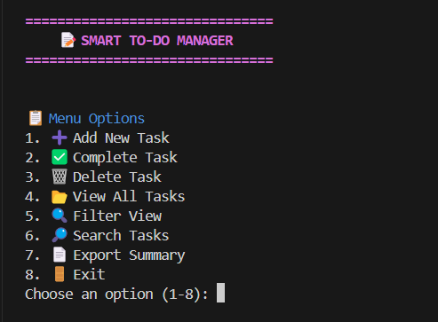

# 📋 Smart To-Do List Manager (Python CLI)

## 🧠 What This Program Does

This is a simple and smart To-Do List Manager built using only Python (no external libraries). It runs in the command line and helps you keep track of your daily tasks easily.

With this program, you can:
- ✅ Add new tasks with a title, description, and due date
- ✅ Mark tasks as completed
- 🗑️ Delete tasks
- 📂 View all tasks in a neat list
- 🔍 Filter tasks (like pending, completed, due today, or overdue)
- 🔎 Search tasks by keywords
- 📄 Export your full task list to a `.txt` file
- 🎨 See your tasks in different colors based on their priority or status

Everything is saved automatically in a file (`tasks.json`) so your tasks are never lost.

---

## ▶️ How to Run This Program

### Step 1: Install Python
Make sure Python 3 is installed on your computer (Python 3.8 or above is best).

### Step 2: Download the Project
Download or clone the project from GitHub:

```bash
git clone https://github.com/your-username/todo-app.git
```
```bash
cd todo-app
```
```bash
python main.py
```
---
## 🧪 Sample Inputs and Outputs




---

## ⚠️ Things That Can Be Improved (TODOs)

🔁 No recurring tasks or repeat options yet

⏰ No reminder or alert feature

📅 Date must be entered in dd/mm/yyyy format (be careful!)

🔐 There’s no login or password — it’s a simple offline tool

🖥️ In the future, we can try building a web version or GUI using Streamlit

---

## 📁 folder_structure:
```bash
  todo-app/
  ├── main.py              # Main program file
  ├── tasks.json           # All your tasks are stored here
  ├── task_summary.txt     # Optional report file when exported
  ├── README.md            # This guide you’re reading
  └── screenshots/         # Extra screenshots for demo
```
---
